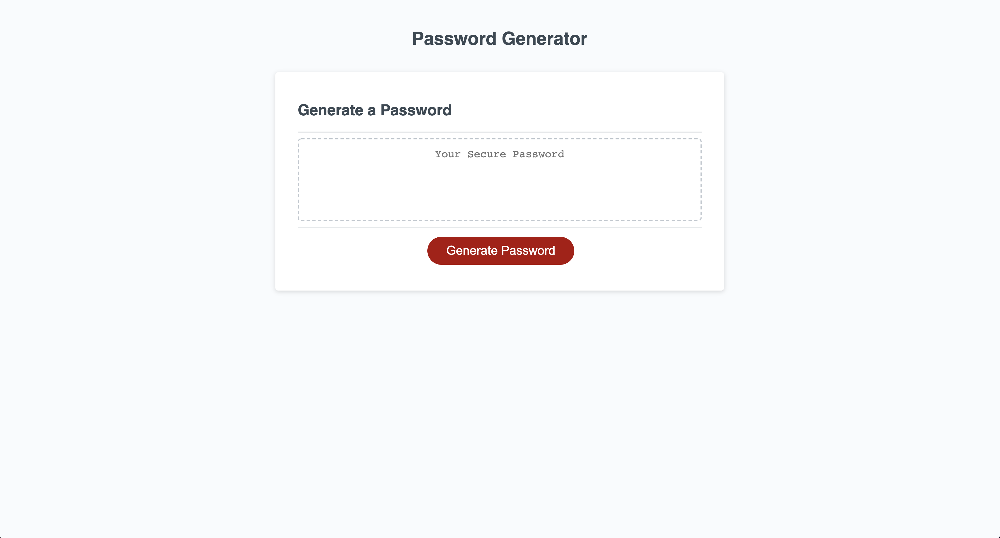
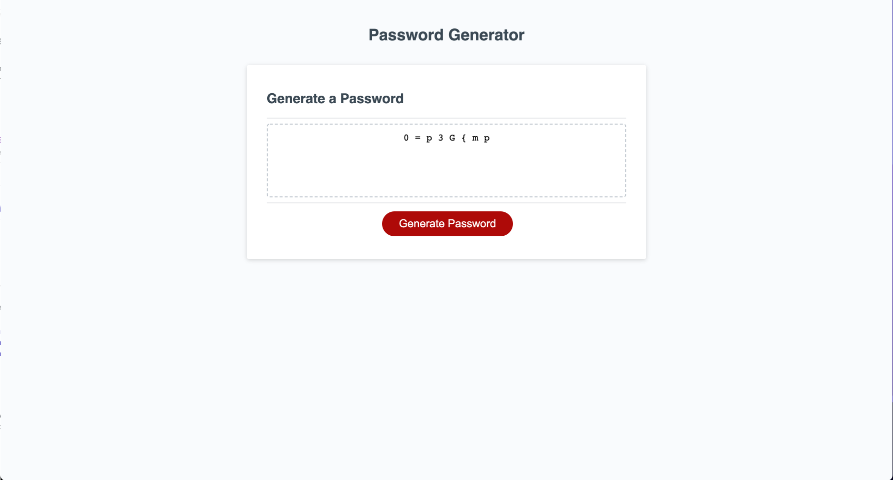

# passwordGenerator

##  Generate a Password!

A fully responsive web application for generating secure and completely unique user passwords.

Upon interaction, the user will be promted with several options including...

* Desired length of password (Between 8-128 characters)
* The use of numbers
* The use of lower-case and or upper-case letters
* The inclusion of special characters

After which, the user is presented with their secure, randomly generated password!

## Screenshots

